# Project.Corridorkey綠幕 架構圖

生成時間：2026-07-02 22:37

## 架構總覽

```mermaid
flowchart TD
    A[專案根目錄] --> B[README.md]
    A --> C[docs/ARCHITECTURE.md]
    A --> D[docs/說明書.html]
    A --> T1[outputs/]
    A --> T2[resolve_tools/]
    A --> T3[scripts/]
    A --> T4[skills/]
    A --> L[主要技術/內容]
    L --> L1[Python: 6 檔]
    L --> L2[React: 1 檔]
    A --> N[關鍵入口檔]
    N --> N1[filming_with_the_green_screen.original.webm]
    N --> N2[filming_with_the_green_screen.person_crop_464x780.mp4]
    N --> N3[filming_with_the_green_screen.person_green_area_crop_400x800.mp4]
    N --> N4[filming_with_the_green_screen.person_upper_green_crop_400x600.mp4]
    N --> N5[filming_with_the_green_screen.test_720p.mp4]
    N --> N6[RUN_RESULT.md]
```

## 主要內容

影像、影片或媒體生產流程。目前偵測到主要內容型態：Python, React。

## 子資料夾

- `outputs/`
- `resolve_tools/`
- `scripts/`
- `skills/`

## 技術/檔案型態

- Python: 6 檔
- React: 1 檔

## 邊界與風險

- 此文件只根據本機檔案結構與非敏感檔名推斷，不讀取或揭露金鑰、token、session、cookie、`.env` 等敏感資料。
- 自動圖只描述目前可見結構；若專案有外部服務、雲端帳號或手動流程，需由後續人工驗收補充。
